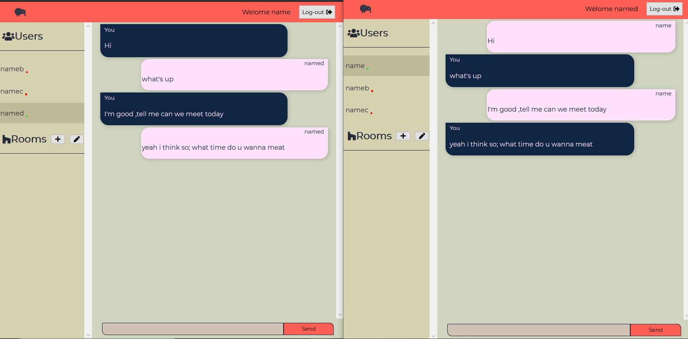

# REACT/FIREBASE anime app



## Description
Chat app built with REACT and NODEJS.
Real time chat and user authentication,also some other functionalities,check live demo on https://mern-socket-chat-app.herokuapp.com

## Technologies & Tools

### Front-end:

* React
* Redux
* Axios

### Backend and Databse:

* Node/Express
* Socket.io
* Mongoose
* PassportJS

## Installation and Usage

### Requirements:

* Node.js installed
* Mongodb connection

### Steps:
1. Clone repo on your local machine:
```
git clone git@github.com:Da3az/mern-chat-app.git
```
2. Install server-side dependencies:
```
$ npm install
```
3. Install client-side dependencies:
```
$ cd client
$ npm install
```
4. Enter Your mongodb uri
```
// Go to server.js and chenge uri to yours

mongoose.connect(uri,{useNewUrlParser : true,useUnifiedTopology: true},()=>{
    console.log('successfully connected to database');
});

```
5. Build the app:
```
$ npm run build
```
6. Execute the app:<br/>
```
$ cd ..
$ npm run start
```
8. App now running on ```localhost:5000```
